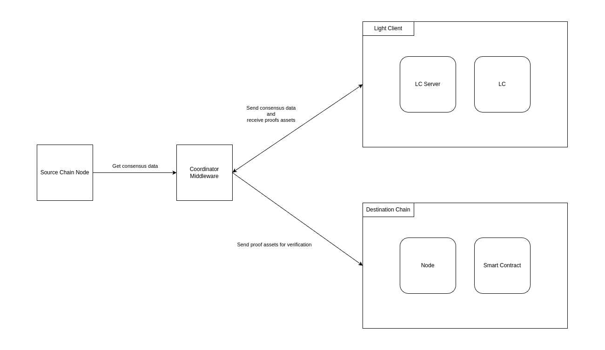

# Architecture components

Light clients can be seen as lightweight nodes that enable users to interact with the blockchain without needing to
download the entire blockchain history. They **rely on full nodes to provide necessary data**, such as block headers,
and use cryptographic proofs to verify transactions and maintain security.

There are four core components that need to exist to have a functional light client bridge running:

- **Source Chain Node**: A full node of the source chain from which it is possible to fetch the necessary data to
  generate our proofs.
- **Coordinator Middleware**: This middleware is responsible for orchestrating the other components that are part of the
  architecture.
- **Light Client**: The core service developed by Lurk. It contains all the necessary logic to generate the necessary
  proofs that is exposed through an RPC endpoint. It also has an underlying storage
- **Verifier**: A software that can verify the proofs generated by the Light Client. Usually it is shaped as a smart
  contract living on a destination chain.

