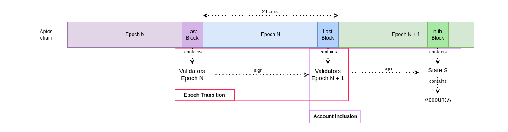

# Design of the Light Client

At the core of the LC there are two features:

- Prove epoch transition on the Aptos chain, which is effectively proving a transition from one set of validators to
  another one.
- Prove at any given point that an account is part of the Aptos state to provide the bridging capabilities between the
  Aptos and another blockchain.

