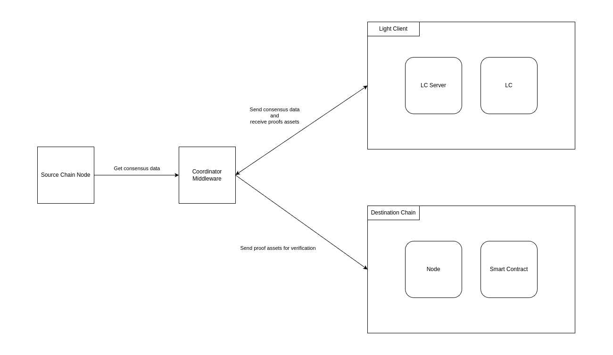

# Architecture components

Light clients can be seen as lightweight nodes that enable users to interact with the blockchain without needing to
download the entire blockchain history. They **rely on full nodes to provide necessary data**, such as block headers,
and use cryptographic proofs to verify transactions and maintain security.

There are four core components that need to exist to have a functional light client bridge running:

- [**Source Chain Node**](./eth_nodes): A full node of the source chain from which it is possible to fetch the
  necessary data to generate our proofs.
- [**Coordinator Middleware**](./clThe bundled example client currently only requests and verifies STARK proofs. The proof servers have support for generating
and verifying SNARK proofs, but the example client does not yet make use of this.ient): This middleware is responsible for orchestrating the other components that are part of the
  architecture.
- [**Light Client Proving Servers**](./proof_server.md): The core service developed by Lurk. It contains all the
  necessary logic to generate the necessary proofs and exposes it through a simple RPC endpoint.
- [**Verifier**](../benchmark/on_chain.md): A software that can verify the proofs generated by the Light Client. This
  verification can happen in a regular computer, using a Rust verifier exposed by the Proof servers, or it can be
  implemented as a smart contract living on a destination chain.

