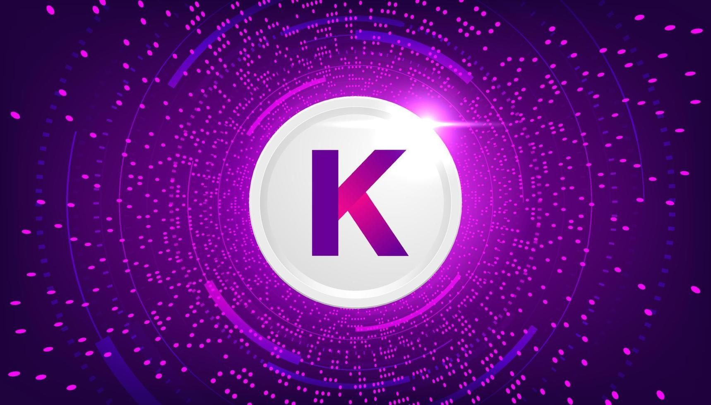

The Kadena Light Client (LC) provides a streamlined and efficient way to verify 
blockchain state transitions and proofs without needing to store or synchronize 
the entire blockchain.

The following documentation aims to provide a high-level overview of the Kadena 
LC and its components, along with a guide on how to set up and run or benchmark 
the Kadena LC.

> **Note**
> 
> The following documentation has been written with the supposition that the
> reader is already knowledgeable about the Chainweb protocol and the Kadena
> blockchain.
> 
> To read about it refer to  [the whitepapers](https://www.kadena.io/whitepapers),
> [the documentation](https://docs.kadena.io/) and 
> [the `chainweb-node` repository wiki](https://github.com/kadena-io/chainweb-node/wiki).
> 
> It is also required that the reader is familiar with Simple Payment Verification (SPV).
> They can refer to the [Bitcoin whitepaper](https://bitcoin.org/bitcoin.pdf) for more information.

### Sections

**[High-level design](./design/overview.md)**

An overview of what is the Light Client and the feature set it provides.

**[Components](./components/overview.md)**

A detailed description of the components that make up the Light Client.

**[Run the Light Client](./run/overview.md)**

A guide on how to set up and run the Light Client.

**[Benchmark the Light Client](./benchmark/overview.md)**

A guide on how to benchmark the Light Client.